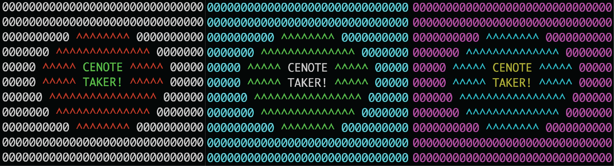
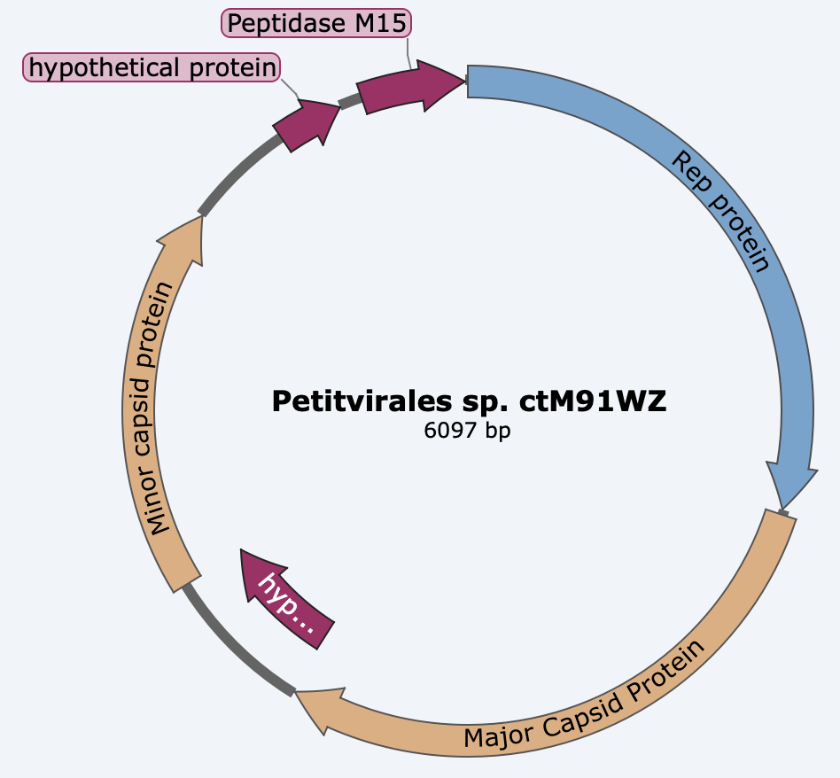
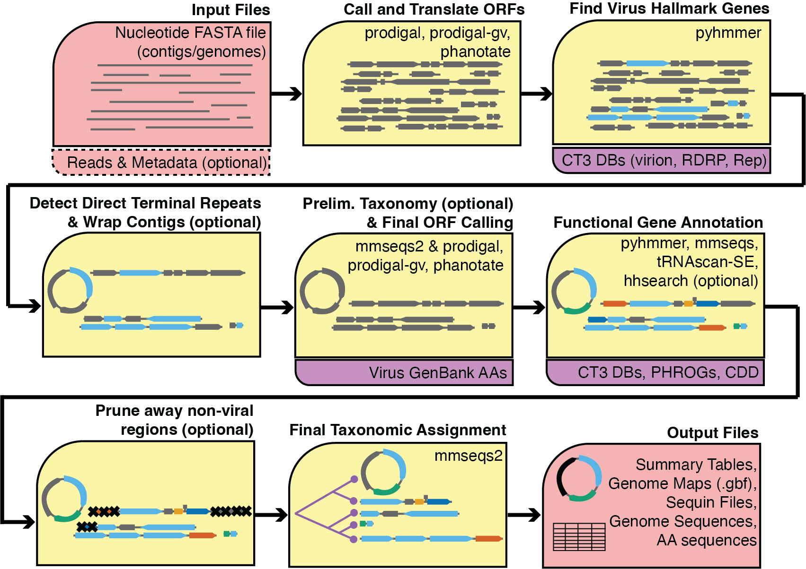

# Cenote-Taker3

[](http://bioconda.github.io/recipes/cenote-taker3/README.html)
[](https://anaconda.org/bioconda/cenote-taker3)

Discover and annotate the virome.



Works on your laptop or HPC (compatible with MacOS and Linux)

`Cenote-Taker 3` is a virus bioinformatics tool that scales from individual genomes sequences to massive metagenome assemblies to:

1)  Identify sequences containing genes specific to viruses (virus hallmark genes)

2)  Annotate virus sequences including:

---a) adaptive ORF calling

---b) a large catalog of HMMs from virus gene families for functional annotation

---c) Hierarchical taxonomy assignment based on hallmark genes

---d) mmseqs2-based CDD database search

---e) tabular (.tsv) and interactive genome map (.gbf) outputs

**Also, `Cenote-Taker 3` is very fast, many many times faster than `Cenote-Taker 2` for large datasets, and faster than comparable annotation using `pharokka` with more function annotation for virus genes (in my hands)**

Image of example genome map:



### Use Cases

1) Discovering virus contigs in metagenomic data

2) Annotating virus sequences without highly similar well-annotated reference

3) Finding prophages (or proviruses) in microbial genomes

### Not-Use Cases

1) Not for read-level classification of known viruses (see [Marker-MAGu](https://github.com/cmmr/Marker-MAGu) or [EsViritu](https://github.com/cmmr/EsViritu) for this task)

2) Not ideal for annotating virus genomes that are highly similar to known references (e.g. phage lambda with a few mutations).

## Schematic



## Installation Instructions

**Most recent versions**

Cenote-Taker 3 scripts:   `v3.4.0`
Cenote-Taker 3 Databases: `v3.1.1`

**This should work on MacOS and Linux**

*Versions used in test installations*

`mamba 1.5.8`

`conda 24.7.1`

### Bioconda package (most users)

`mamba` is better/faster than `conda` for almost all solving/installation tasks

1) Use `mamba` to install the bioconda package

**macOS** (specify `osx-64` platform regardless of which chip you have)

`mamba create --platform osx-64 -n ct3_env -c conda-forge -c bioconda cenote-taker3=3.4.0`

**linux**

`mamba create -n ct3_env -c conda-forge -c bioconda cenote-taker3=3.4.0`

<details>

  <summary>Using conda instead</summary>

  **macOS** (specify `osx-64` platform regardless of which chip you have)

  `conda create --platform osx-64 -n ct3_env -c conda-forge -c bioconda cenote-taker3=3.4.0`

  **linux**

  `conda create -n ct3_env -c conda-forge -c bioconda cenote-taker3=3.4.0`

</details>


2)  Activate the conda environment.

`conda activate ct3_env`


*You should be able to type `cenotetaker3` and `get_ct3_dbs` in terminal to bring up help menu now*

3)  Change to a directory where you'd like to install databases and run database script, specify DB directory with `-o`.

*Total DB file size of 3.0 GB after file decompression*

`cd ..`

`get_ct3_dbs -o ct3_DBs --hmm T --hallmark_tax T --refseq_tax  T --mmseqs_cdd T --domain_list T`

<details>

  <summary>With optional hhsuite databases</summary>
  
  Warning: due to inconsistent server speed, these downloads may take over 2 hours.
  
  You may download one or more hhsuite DB.
  
  The data footprint is:
  
  | Database | Size   |
  |----------|--------|
  | CDD      | 6.1 GB |
  | pfam     | 4.6 GB |
  | pdb70    | 56 GB  |
  
  ```         
  get_ct3_dbs -o ct3_DBs --hmm T --hallmark_tax T --refseq_tax T --mmseqs_cdd T --domain_list T --hhCDD T --hhPFAM T --hhPDB T
  ```

</details>

4)  Set the database directory as a conda environmental variable.

`conda env config vars set CENOTE_DBS=/path/to/ct3_DBs`

### From source (development versions)

1)  Clone this GitHub repo

2)  Using `mamba` (package manager within `conda`) and the provided yaml file, make the environment:

`mamba env create -f Cenote-Taker3/environment/ct3_env.yaml`

3)  Activate the conda environment.

`conda activate ct3_env`

4)  Change to repo and `pip` install command line tool.

`cd Cenote-Taker3`

`pip install .`

*You should be able to type `cenotetaker3` and `get_ct3_dbs` in terminal to bring up help menu now*

5)  Change to a directory where you'd like to install databases and run database script, specify DB directory with `-o`.

*Total DB file size of 3.0 GB after file decompression*

`cd ..`

`get_ct3_dbs -o ct3_DBs --hmm T --hallmark_tax T --refseq_tax T --mmseqs_cdd T --domain_list T`

<details>

  <summary>With optional hhsuite databases</summary>
  
  Warning: due to inconsistent server speed, these downloads may take over 2 hours.
  
  You may download one or more hhsuite DB.
  
  The data footprint is:
  
  | Database | Size   |
  |----------|--------|
  | CDD      | 6.1 GB |
  | pfam     | 4.6 GB |
  | pdb70    | 56 GB  |
  
  ```         
  get_ct3_dbs -o ct3_DBs --hmm T --hallmark_tax T --refseq_tax T --mmseqs_cdd T --domain_list T --hhCDD T --hhPFAM T --hhPDB T
  ```

</details>

6)  Set the database directory as a conda environmental variable.

`conda env config vars set CENOTE_DBS=/path/to/ct3_DBs`

## Running Cenote-Taker 3

*Make sure conda environment is activated*

### Help Menu

```         
cenotetaker3 -h
```

### Test contigs

```         
cenotetaker3 -c Cenote-Taker3/test_data/testcontigs_DNA_ct2.fasta -r test_ct3 -p T
```

### Default Discover and Annotate

```         
cenotetaker3 -c my_metagenome_contigs.fna -r my_meta_ct3 -p T
```

### Recommended settings for microbial genomes

```         
cenotetaker3 -c my_metagenome_contigs.fna -r my_meta_ct3 -p T --lin_minimum_hallmark_genes 2
```

### Discover and Annotate, Force `prodigal` (`prodigal-gv` is default)

```         
cenotetaker3 -c my_metagenome_contigs.fna -r my_meta_ct3pr -p T --caller prodigal
```

### Just Annotate

```         
cenotetaker3 -c my_virus_contigs.fna -r my_virs_ct3 -p F -am T
```

### Choose which HMM DBs are hallmark (virion rdrp is default)

```         
cenotetaker3 -c my_metagenome_contigs.fna -r my_meta_ct3 -p T -db virion rdrp dnarep
```

### Calculate coverage level with reads

```         
cenotetaker3 -c my_metagenome_contigs.fna -r my_meta_ct3 -p T --reads my_reads/*fastq
```

## Output Files

<pre>
{run_title}/
|   {run_title}_virus_summary.tsv                 <b><- main summary file for each virus</b>
|   {run_title}_virus_sequences.fna               <b><- all virus genome seqs</b>
|   {run_title}_virus_AA.faa                      <b><- all virus AA seqs</b>
|   {run_title}_prune_summary.tsv                 <b><- summary of pruning of each sequence</b>
|   final_genes_to_contigs_annotation_summary.tsv <b><- annotation info, all genes</b>
|   run_arguments.txt                             <b><- arguments used in this run</b>
│   {run_title}_cenotetaker.log                   <b><- main log file</b>
│
└───sequin_and_genome_maps/
│   │   {run_title}*gbf                           <b><- genome maps</b>
│   │   {run_title}*fsa                           <b><- genome sequence</b>
│   │   {run_title}*gtf                           <b><- feature table gtf format</b>
│   │   {run_title}*tbl                           <b><- feature table sequin format</b>
│   │   {run_title}*sqn                           <b><- non-human-readable sequin file for GenBank sub</b>
│   │   {run_title}*cmt                           <b><- sequin comment file</b>
│
└───ct_processing/
    │   <b>--- many intermediate files ---</b>
</pre>


### Ideas for downstream analyses

[CheckV](https://github.com/cmmr/Marker-MAGu) for virus genome completeness estimation.

[BACPHLIP](https://github.com/adamhockenberry/bacphlip) for phage lifestyle prediction (only use complete/near-complete phage genomes).

[VContact3](https://bitbucket.org/MAVERICLab/vcontact3/src/master/) for genome clustering and taxonomy.

[iPHoP](https://bitbucket.org/srouxjgi/iphop/src/main/) for prokaryotic virus host prediction.

### Notes

`Cenote-Taker 3` is under active development, so please open an issue if anything seems unusual or any errors occur. It's likely that I've not tested every parameter combination, and bugs will be a simple fix.

### To-do list

-   instructions for manual curation -\> GenBank deposit of `Cenote-Taker 3` output
